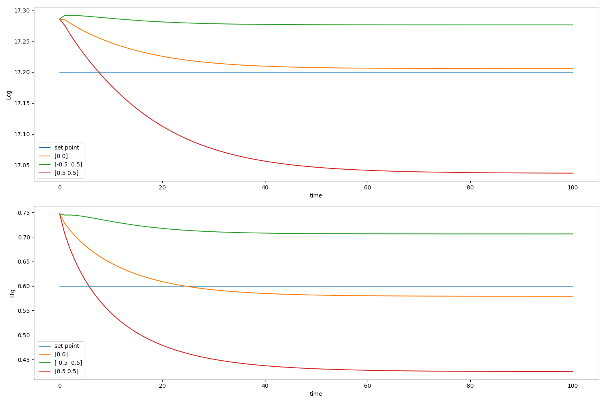
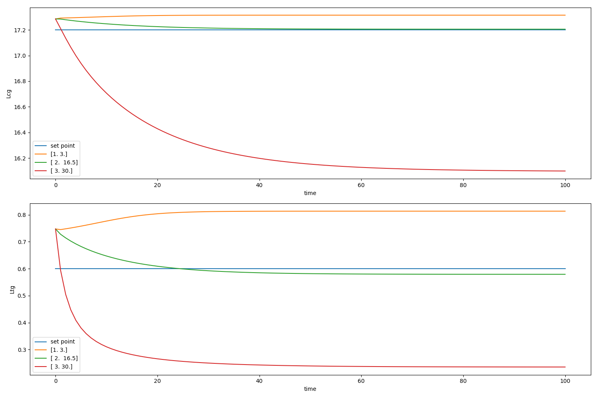
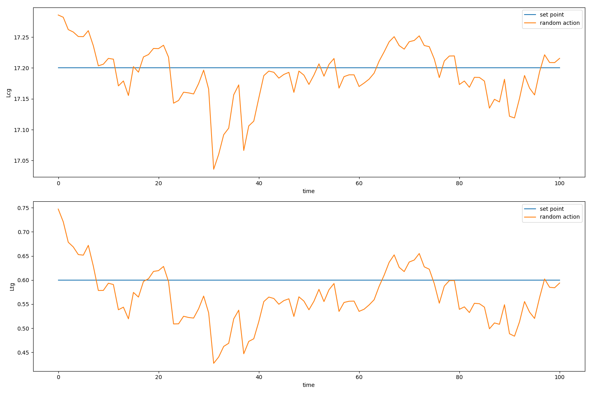

# 仿真模型测试工具

### 用途

可以对仿真模型在不同控制命令下的运行效果进行测试

### 使用方法

```python
def simulation_test(Env=None, mode="uniform",init_para=None,
                    seprate_num=5, const_u=None,
                    test_step=200, y_name=None,
                    eval_plt_param=None,
                    ):

```


参数详解:

- Env : 要仿真测试的对象**类**

  > 直接传类，不要传对象

- mode：测试模式，分为以下三种：

  - "const": 恒定控制指令模式
  - "random": 随机控制指令
  - "uniform":均匀选择控制指令

- init_para :要仿真类的初始化参数，需要传字典，默认为{}

- seprate_num: mode选择为uniform时才有意义，定义为从控制指令区间中均匀选择几个控制指令(实际选的比seprate_num多一个)

- const_u：mode选择为const时才有意义，表示恒定的控制指令是什么。

  该字段必须为列表形式，如[[0, 0], [-0.5, 0.5], [0.5, 0.5]] 或[[3,14]]

- test_step：测试迭代次数，默认为200（即f的执行次数)

- y_name：y中每个变量的名字，默认为Env的y_name

- eval_plt_param，绘图参数，需要输入字典。一般必须要指定的有figsize,让图看着长宽合适


### 使用范例

该范例以赤铁矿浮选仿真模型为例，展示其使用方法与使用效果

1. const模式

```python
# 引入仿真模型
from Control_Exp1001.simulation.flotation import Flotation
# 引入模型测试工具
from Control_Exp1001.simulation.simulation_test import simulation_test
para = {
    "normalize": True,
}
# 将模型的控制做一个控制指令归一化，恒定以[0, 0], [-0.5, 0.5], [0.5, 0.5]三种控制指令进行控制
simulation_test(Flotation, init_para=para, mode="const",
                const_u=[[0, 0], [-0.5, 0.5], [0.5, 0.5]],
                test_step=100, eval_plt_param={"figsize": (15, 10)})

```

#### 效果



共三条线，每条线代表一个模型的变化过程

2. uniform模式

```python
simulation_test(Flotation, seprate_num=2, test_step=100, eval_plt_param={"figsize": (15, 10)})
```

init_para设为默认的{}，seprate_num为2，代表从u_bounds空间中均匀选3个控制指令，并进行恒定控制



3. random模式

```python
simulation_test(Flotation, mode="random", test_step=100, eval_plt_param={"figsize": (15, 10)})
```



每次从u_bounds空间中随机选1个控制指令，并进行控制。