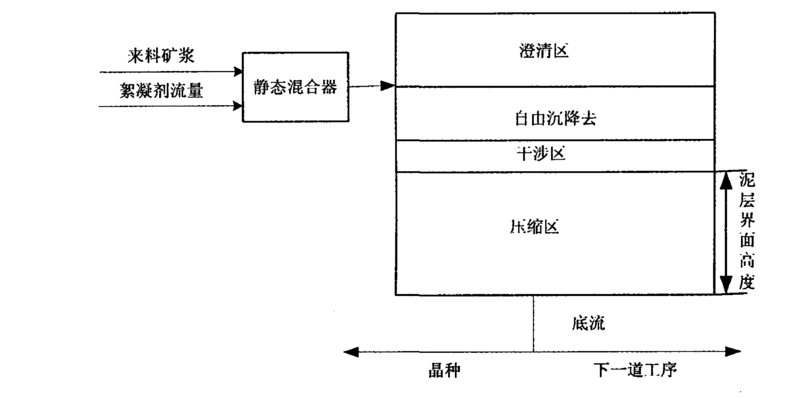
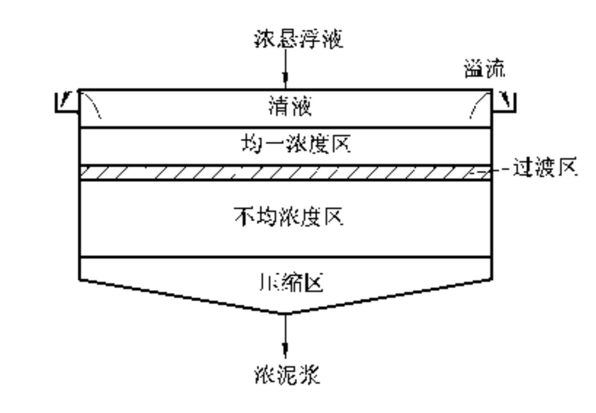
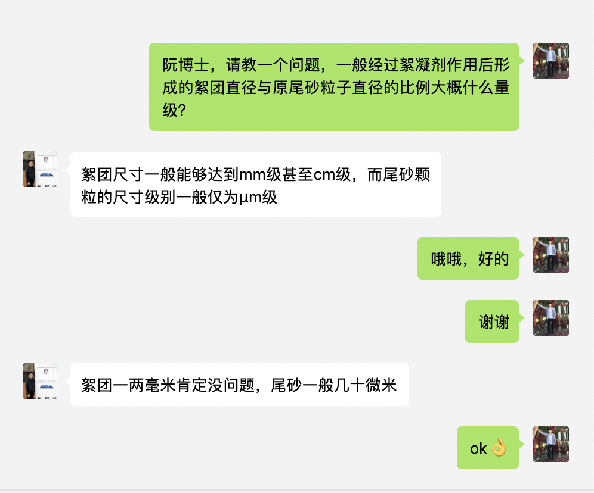
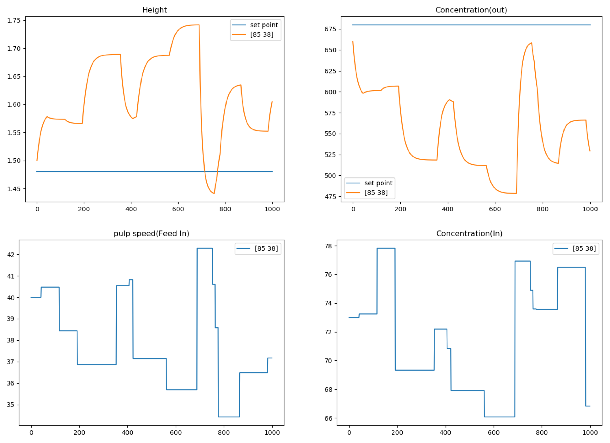
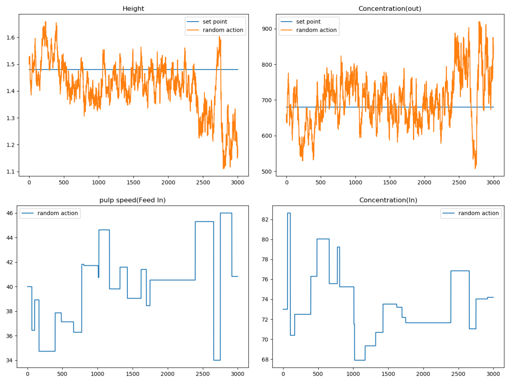
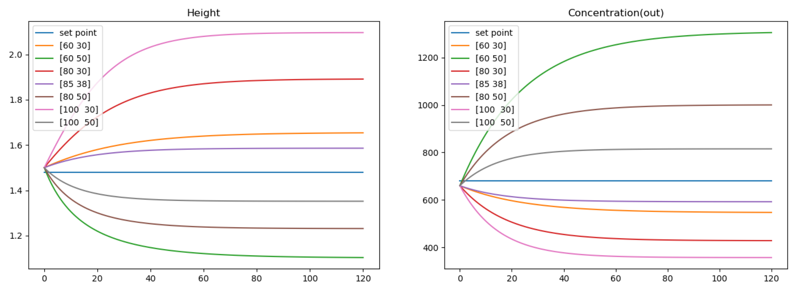

# 赤铁矿浮选仿真模型

## 模型简介

该仿真模型用于仿真选矿过程中普通浓密机的动态变化规律。

浓密机是一个典型沉降分离工具，低浓度料浆经过与絮凝剂混合，流入浓密机中，通过重力作用，粒子下沉，在浓密机底部形成高浓度压缩区，以高浓度底流的形式流入下一个工序中，清水从浓密机上部的溢流区流走。在选矿过程中，底流料浆往往要通过晶种泵，进行二次浮选。一个选矿工艺流程中的浓密机如图所示：

 




在我们的课题背景中，浓密机用于充填过程的膏体制备，因此去掉底流流往晶种泵的过程，浓密机主视透视图如下图所示：




来个英文的：

> Xu, N., Wang, X., Zhou, J., Wang, Q., Fang, W., & Peng, X. (2015). International Journal of Mineral Processing An intelligent control strategy for thickening process. *International Journal of Mineral Processing*, *142*, 56–62. https://doi.org/10.1016/j.minpro.2015.01.007


## 仿真模型

### 参量定义

#### 控制变量 

$u = \left[ f _ { u } , f _ { f } \right] ^ { T }$ 

- 含义：底流泵速、絮凝剂泵速 

- 上下限 

  $u _ { \mathrm { min } } = [ 40,30 ] ^ { T }$ 

  $u _ { \max } = [ 120,50 ] ^ { T }$ 

- 初始值：[80, 38]


#### 目标变量 

$y = \left[h(t) ,c_u(t) \right] ^ { T }$

- 含义：泥层高度($H$)、底流密度$kg/ m^3$（单位体积固体质量） 

- 上下限 

  $y _ { \mathrm { min } } = [ 0.75,280 ] ^ { T }$ 

  $y _ { \max } = [ 2.5, 1800] ^ { T }$  

- 目标设定点位 

  $y ^ { * } = [ 1.48 ; 680 ] ^ { T }$ 

- 初始值 

  $y  = [ 1.5 ; 660 ] ^ { T }$ 


#### 过程可观测参量 

$c = \left[f_i, c_i  \right] ^ { T }$

含义：进料泵频、进料浓度（单位体积固体质量）  

| Variable | 参考取值   | 默认初值 | 下限       | 上限       |
| -------- | ---------- | -------- | ---------- | ---------- |
| $f_i$    | 40$Hz$     | 40       | 34$Hz$     | 46$Hz$     |
| $c_i$    | 73$kg/m^3$ | 73       | 63$kg/m^3$ | 83$kg/m^3$ |

该参数支持恒定和波动两种形式：

- 恒定模式：始终保持(40, 73)

- 波动模式：每次有一定概率更新c值，新的c值服从一个二维高斯分布


### 浓密机动态模型机理 

这个动态模型的探索历程比较复杂，容我慢慢讲述。

模型主要参考:

> - 王猛. 矿浆中和沉降分离过程模型软件的研发[D]. 沈阳：东北大学，2011.
>
> - Borut Zupancic. Extension software for real-time control system design and implementation with MATLAB-SIMULINK [J], Simulation Practice and Theory, 1998,6 : 703 - 719.
> - 唐谟堂，唐刿.湿法冶金设备[M]，长沙：中南大学出版社，2002，137-149.

还有一些其他的参考文献，提供了启发和线索，但是没有体现在模型推导中：

> - Youngchul Kim, Wesley O Pipes. Factors influencing suspended solids concentrations in activated sludge settling tanks [J]. Journal of Hazardous Materials, 1999(B69): 95-109.
> - Kim B H, Klima M S. Development and Application of a Dynamic Model for Hindered-Settling Column Separations [J]. Minerals engineering, 2004, 17(3): 403-410.
> - 李海波. 赤铁矿混合选别全流程智能控制系统的研究[D]. 沈阳：东北大学，2014.
> - 武成瑞, 贾瑶, 王琳岩. 混合选别过程半实物仿真系统[J]. 工程科学学报, 2017, 39(9):1412-1420.
> - 王琳岩, 李健, 贾瑶, et al. 混合选别浓密过程双速率智能切换控制[J]. 自动化学报, 2018, 44(2).
> - 混合选别浓密机底流矿浆浓度和流量区间智能切换控制方法[J]. 自动化学报, 2014, 40(9):1967-1975.
> - 马鲁铭，高延耀. 湿法冶金设备[M]. 长沙：中南大学出版社，2001，132-154.
> - 姜志新，谢志铨. 湿法冶金分离工程[M]. 北京：原子能出版社，1993，121-158
> - Wang L , Jia Y , Chai T , et al. Dual Rate Adaptive Control for Mixed Separation Thickening Process Using Compensation Signal Based Approach[J]. IEEE Transactions on Industrial Electronics, 2017, PP(99):1-1.

还有和阮博士的聊天记录也很重要：



具体模型推导过程参看同目录下的——“普通浓密机仿真方程推导.md”


## 使用说明

1. 仿真环境对象初始化

   ```python
   class Thickener(BaseEnv):
       def __init__(self, dt=1, penalty_calculator=None,noise_in=False,noise_p=0.01,
                    size_yudc=None, u_low=None,
                    u_high=None,
                    c_low=None,
                    c_high=None,
                    normalize=False,
                    time_length=60,
                    one_step_length=0.0001,
                    y_name=None,
                    u_name=None,
                    c_name=None,
                    c_start = None,
                    y_start = None,
                    mean_c = None,
                    cov_c = None
                    ):
   
   ```

   参数详解:

   - dt : 仿真间隔，代表每一步仿真会执行$f$多少次，默认为1

   - penalty_calculator：惩罚计算器，详情见"组件库——惩罚计算器"

   - u_low: 代表控制参量的**下限**，仿真过程中如果某个控制变量低于下限会对其限制，可默认。

   - u_high: 代表控制参量的**上限**，仿真过程中如果某个控制变量高于上限会对其限制，可默认。

     > 对象已经构建后如何访问其控制变量上下限？
     >
     > ```
     >  #访问控制命令下限
     >  low_u = self.external_u_bounds[:, 0]
     >  #访问控制命令上限
     >  high_u = self.external_u_bounds[:, 1]
     > ```
     >
     >


   - normalize:是否将action的输入范围规整到(-1,1)区间，为**True**代表开启
   - time_length：每调用一次f函数，仿真time_length长的时间，该参数可以非整数
   - one_step_length： 如果动态模型是微分方程，需采用迭代逼近的方法求解模型，one_step_length代表每次迭代的时间步长，即梯形宽度。
   - noise_in ：为True则开启输入噪音
   - noise_p:每次进行仿真更新c的概率，仅当noise_in开启时有效
   - mean_c：定义c分布的均值，默认[40,73]
   - cov_c：定义c分布的协方差，默认[10, 0],[0, 18]
   - c_start:c的初值
   - y_start:y的初值


2. 参量重置

- C变量重置

```python
def reset_c(self):
	return np.copy(self.c_start)

```

默认[40, 73]，可通过继承该类进行更改。

- u变量重置

```python
 def reset_u(self):
	return np.array([1,10],dtype=float)
```

默认为[80， 38]


3. 对于环境的可观察参量

```python
def observation(self):
        return np.hstack([self.y_star, self.y, self.u, self.c])
```

默认将$y^*,y,u,c$拼在一起，大小分别为2，2，

4. 如何开启波动模式：

> env = Thickener(noise_in=True, noise_p=0.008)

- noise_p :更新c的概率


## example


1. 建立一个没有噪音的，全部参数默认的浓密机仿真对象

   ```python
   from Control_Exp1001.simulation.thickener import Thickener
   env = Thickener()
   env.reset() # 初始化仿真环境
   env.step([74, 48]) #执行控制动作
   
   
   """ 
   
   # 初始状态
    目标泥层	目标浓度  当前泥层 当前浓度	  fu	 ff	     fi      ci		
      1.48		680		1.5		660.	80.		38.		40.		73	   
   # 执行动作之后的状态
      1.48		680	  1.4811	676.728 74.     48.     40.     73.	  
   
   
   """
   ```

2. 建立一个有进料噪音的仿真环境，自定义噪音均值方差，及噪音概率

   ```python
   from Control_Exp1001.simulation.thickener import Thickener
   
   env = Thickener(noise_in=True, mean_c=[45, 70], cov_c=[[8,0],[0, 11]],noise_p=0.5)
   env.reset()
   env.step([80, 48])
   
   
   """
   每轮迭代后结果
   目标泥层	目标浓度  当前泥层 当前浓度	  fu	 ff	     fi      ci		
   1.48		680		1.5		660.	80.		38.		40.		73	
   1.48       680.     1.4837  674.364 80.		48.     40.950  72.85157692
   1.48       680.     1.4670  689.401 80.		48.     36.750	75.91419317
   1.48       680.     1.4567	699.522	80.  	48.     36.750	75.91419317 
   
   """
   
   ```


### 效果展示

1.开启噪音情况下，固定控制策略，底流泵速为85，絮凝剂泵速为38情况下,noise_p为0.01：




2.开启噪音情况下，控制策略为随机策略（从u_bounds中随机选择），底流泵速为85，絮凝剂泵速为38情况下,noise_p为0.01：




3.无噪音情况下，不同控制策略，方程收敛效果：




