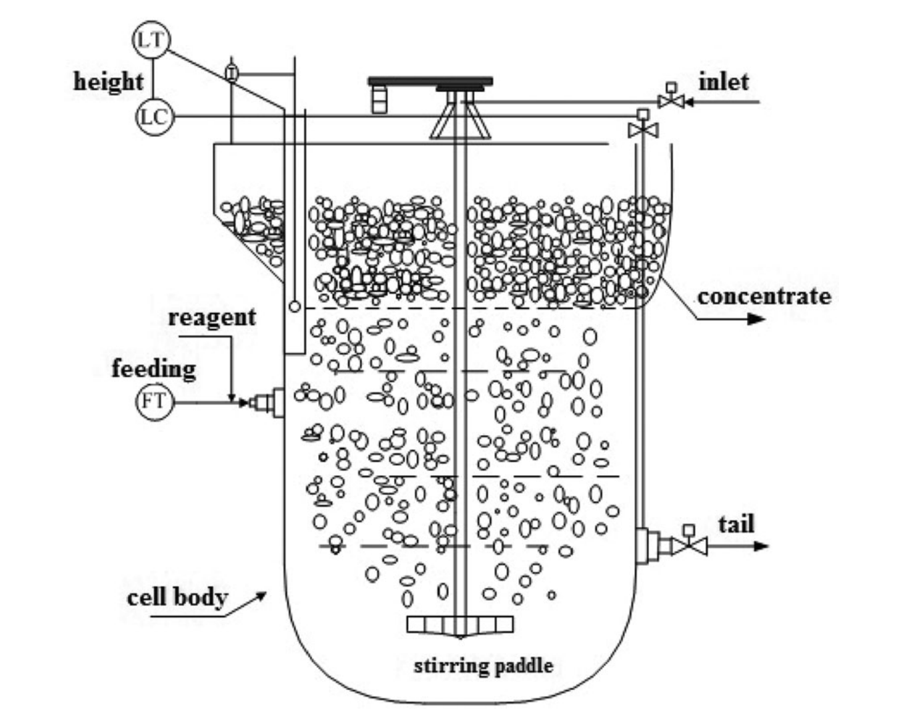
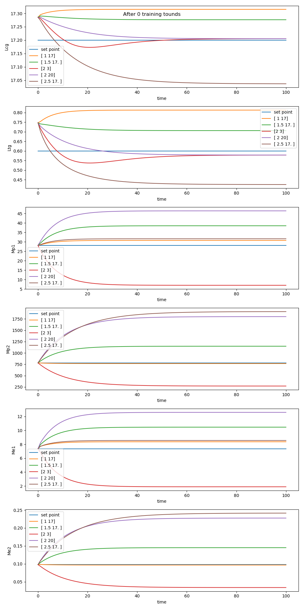
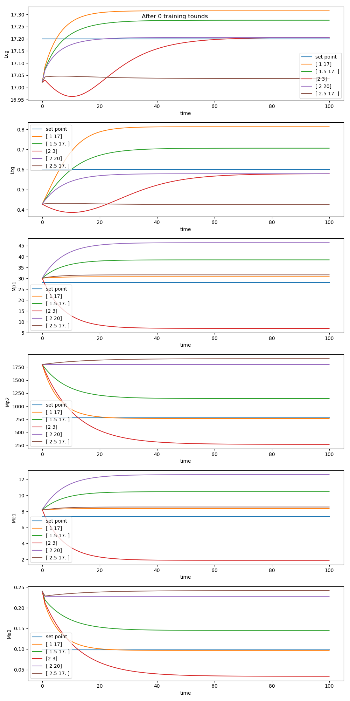
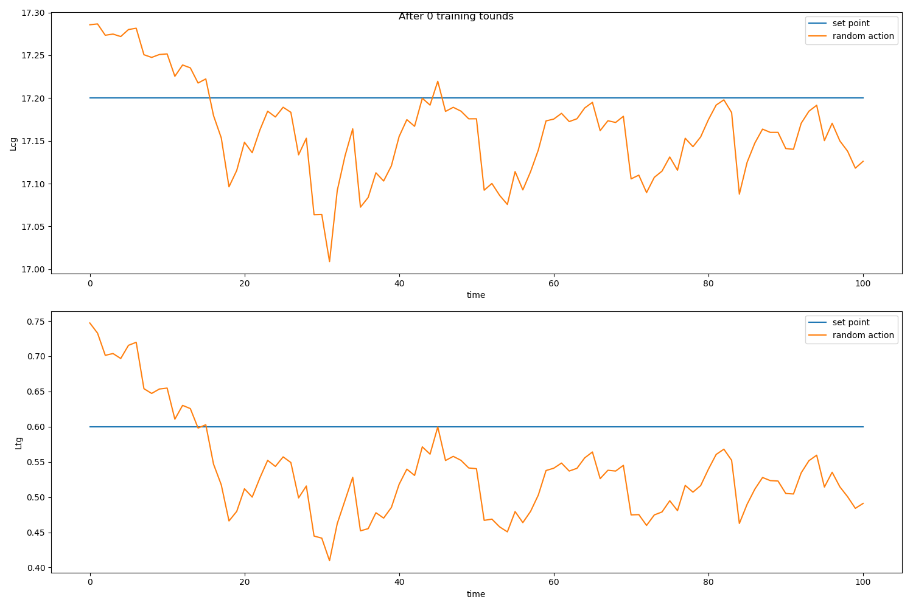

# 赤铁矿浮选仿真模型

## 模型简介

该仿真模型用于仿真选矿过程中浮选槽内的动态变化规律。一个浮选槽如图所示




### 参量定义

#### 控制变量 

$u = \left[ h _ { p } , q _ { a } \right] ^ { T }$ 

- 含义：旋桨高度、进料流量 

- 上下限 

$u _ { \mathrm { min } } = [ 1,3 ] ^ { T }$ 

$u _ { \max } = [ 3,30 ] ^ { T }$ 


#### 目标变量 

$y = \left[ L _ { c g } , L _ { t g } \right] ^ { T }$ 

- 目标设定点位 

  $y ^ { * } = [ 17.27 ; 0.60 ] ^ { T }$ 

- 初始值 

根据$Mp$，$Me$确定

#### 过程参量 

$c = \left[ M _ { p } ^1 , M _ { p } ^2 ,M _ { e } ^1 , M _ { e } ^2 \right] ^ { T }$ 

| Variable | 参考初值范围 |
| -------- | ------------ |
| $M_p^1$  | 5-45         |
| $M_p^2$  | 250-1750     |
| $M_e^1$  | 2-13         |
| $M_e^2$  | 0.05-0.25    |

### 动态模型 


$\begin{aligned} \frac { d M _ { p } ^ { i } } { d t } & = - \left( k _ { p } ^ { i } + \frac { q _ { T } } { A h _ { p } } \right) M _ { p } ^ { i } + k _ { e } ^ { i } M _ { e } ^ { i } + q _ { a } X _ { a } ^ { i } \\ \frac { d M _ { e } ^ { i } } { d t } & = - \left( k _ { e } ^ { i } + \frac { q _ { c } } { A \left( H - h _ { p } \right) } \right) M _ { e } ^ { i } + k _ { p } ^ { i } M _ { p } ^ { i } \end{aligned}$ 

$X _ { a } ^ { 2 } = \frac { g _ { c p } ^ { 1 } - g _ { a } } { g _ { a } - g _ { c p } ^ { 2 } } X _ { a } ^ { 1 }$ 

$L _ { c g } = \frac { M _ { e } ^ { 1 } g _ { c p } ^ { 1 } + M _ { e } ^ { 2 } g _ { c p } ^ { 2 } } { M _ { e } ^ { 1 } + M _ { e } ^ { 2 } } L _ { c u }$ 

$L _ { t g } = \frac { M _ { p } ^ { 1 } g _ { c p } ^ { 1 } + M _ { p } ^ { 2 } g _ { c p } ^ { 2 } } { M _ { p } ^ { 1 } + M _ { p } ^ { 2 } } L _ { c u }$ 

### 常量参数 


| Variable            | Value                | Variable    | Value       |
| ------------------- | -------------------- | ----------- | ----------- |
| $k _ { e } ^ { 1 }$ | 65.6$\min ^ { - 1 }$ | $g _ { a }$ | 0.0234      |
| $k _ { e } ^ { 2 }$ | 316min$^{-1}$        | A           | 53.2$m^2$   |
| $k^1_p$             | 17.9min$^{-1}$       | $H$         | 3.2m        |
| $k^2_p$             | 0.04min$^{-1}$       | $L_{cu}$    | 42.1%       |
| $g^1_{cp}$          | 0.417                | $g^2_{cp}$  | 0.0034      |
| $q_T$               | 0.9679*(qa -qc)$m^3/min$         | $q_c$       | 7.392$m^3/min$ |
| $X_a^1$             | 0.1549                  | $X_a^2$     | 7.872       |


### 两种初值状态下的模型收敛情况

####初始$Lcg$和$Ltg$较高情况下

##### 系统初始值

| Variable | steady Value |
| -------- | ------------ |
| $M_p^1$  | 28.12        |
| $M_p^2$  | 780          |
| $M_e^1$  | 7.36         |
| $M_e^2$  | 0.098        |




#### 初始$Lcg$和$Ltg$较低情况下

##### 系统初始值

| Variable | steady Value |
| -------- | ------------ |
| $M_p^1$  | 16.8         |
| $M_p^2$  | 1123         |
| $M_e^1$  | 4.56         |
| $M_e^2$  | 0.2          |



##### 结论

通过观察两个实验结果，可发现选择不同控制参量，系统达到稳态时，$Mp$，$Me$各不相同，但是当两种控制参量的$hp$相同时，$Lcg$和$Lcg$的收敛性值相同，不同的$qa$仅会影响系统收敛速度。当$Lcg$和$Lcg$小于设定点位时，选择较大的qa有助于快速使$Lcg$和$Lcg$升高。当$Lcg$和$Lcg$大于设定点位时，选择较小的qa有助于快速使$Lcg$和$Lcg$下降。

#### 随机控制命令下的模型变化(仅显示$y$的变化)




$Lcg$在17到17.25范围内波动，$Ltg$在0.4到0.7范围内波动

## 使用说明

1. 仿真环境对象初始化

   ```python
   class Flotation(BaseEnv):
   	def __init__(self, dt=1, reward_calculator=None,
                    size_yudc=None, u_low=np.array([1,3], dtype=float),
                    u_high=np.array([3,30],dtype=float), normalize=False,
                    time_length=1,
                    one_step_length=0.001,
                    y_name=None
                    ):
   
   ```

   参数详解:

   - dt : 仿真间隔，代表每一步仿真会执行$f$多少次，默认为1

   - reward_calculator：奖赏计算器，详情见"组件库——奖赏计算器"

   - size_yudc :默认为[2,2,0,4]

   - u_low: 代表控制参量的**下限**，仿真过程中如果某个控制变量低于下限会对其限制，可默认。

   - u_high: 代表控制参量的**上限**，仿真过程中如果某个控制变量高于上限会对其限制，可默认。

     > 对象已经构建后如何访问其控制变量上下限？
     >
     > ```
     >  #访问控制命令下限
     >  low_u = self.external_u_bounds[:, 0]
     >  #访问控制命令上限
     >  high_u = self.external_u_bounds[:, 1]
     > ```
     >
     >


   - normalize:是否将action规整到(-1,1)区间，为**True**代表开启

   - time_length：每调用一次f函数，仿真time_length长的时间，该参数可以非整数
   - one_step_length： 如果动态模型是微分方程，需采用迭代逼近的方法求解模型，one_step_length代表每次迭代的时间步长，即梯形宽度。


2. 参量重置

- C变量重置

```python
def reset_c(self):
	c = np.array([28.12, 780, 7.36, 0.098], dtype=float)
	#c = np.array([16.8, 1123, 4.56, 0.2],dtype=float)
	return c
```

默认为[28.12, 780, 7.36, 0.098]，可通过继承该类进行更改。

- u变量重置

```python
 def reset_u(self):
	return np.array([1,10],dtype=float)
```

默认为[1， 10]


2. 对于环境的可观察参量

```python
def observation(self):
	return np.hstack([self.y_star, self.y, self.u])
```

默认将$y^*,y,u$拼在一起

### 仿真模型测试

