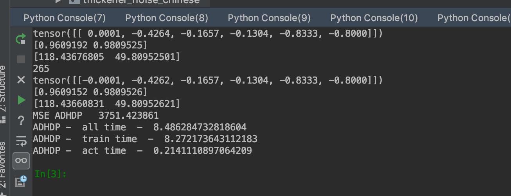

# 浓密机控制案例

```demo/thickener/```下是利用ADP算法实现浓密机控制的源代码，被控仿真模型参见```仿真模型/普通浓密机仿真```，目前调通的控制算法有：

- HDP：启发式动态规划，效果最差，代码位置```thickener/controllers/hdp```
- HCNVI：又名VI(value iterate)，相比于HDP去掉了动作网络，效果一般情况下比HDP好，代码位置```thickener/controllers/value_iterate```
- DHP：双启发式动态规划，效果最好代码位置```thickener/controllers/dhp_lijia```

> ZHANG, H.-G., ZHANG, X., LUO, Y.-H., & YANG, J. (2013). An Overview of Research on Adaptive Dynamic Programming. *Acta Automatica Sinica*, *39*(4), 303–311. https://doi.org/https://doi.org/10.1016/S1874-1029(13)60031-2

### 代码运行方法

在```thickener/exp_script```下，每个文件可以**单独运行**，代表一个实验

>  如：**vi_hdp_dhp**代表三个方法对比，vi_hdp_dhp

如**vi_hdp_dhp**代表三个方法对比


## 仿真实验参数设定

- 浓密机参数

```
thickner_para = {
    "dt":1,
    "noise_in": False,
    "noise_p": 0.002,
    "noise_type": 3,
    'time_length': 20,# 浓密机每次仿真20秒
}
```

其中除了noise_type，其他的就不要改了

| noise_type取值 | 效果                                     |
| -------------- | ---------------------------------------- |
| 1              | 仿真模型迭代400轮后将c修改为[35, 65]     |
| 2              | 每次迭代c会随机变化，变化量服从正态分布N |
| 3              | 仿真模型迭代800轮后将c修改为[35, 65]     |
| 其他           | c始终不变                                |

## 实验结果路径

### 控制效果图

```/thickener/images```路径下，每个实验脚本对应一个文件夹，里面有y、u、c以及效用值的变化图。

### 时间对比

```thickener/time_cmp_data```下记录每个算法运行时间，```thickener/time_bar_plot```画图

每个实验脚本跑完后，控制台会输出每个算法运行时间

如：



