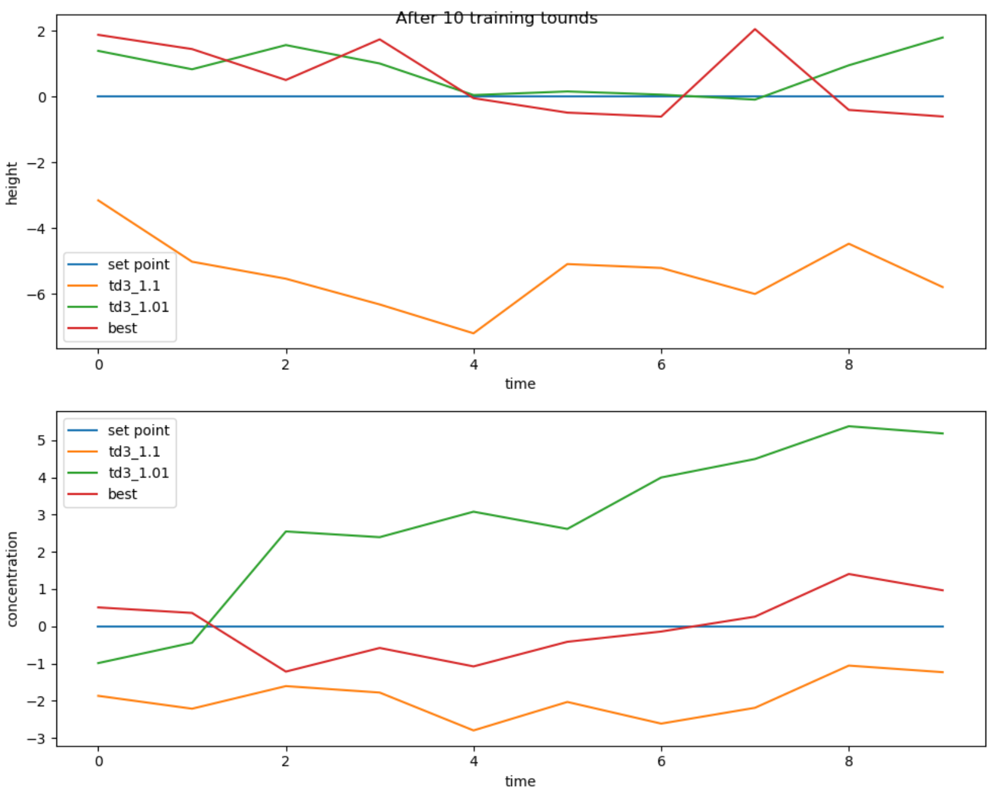
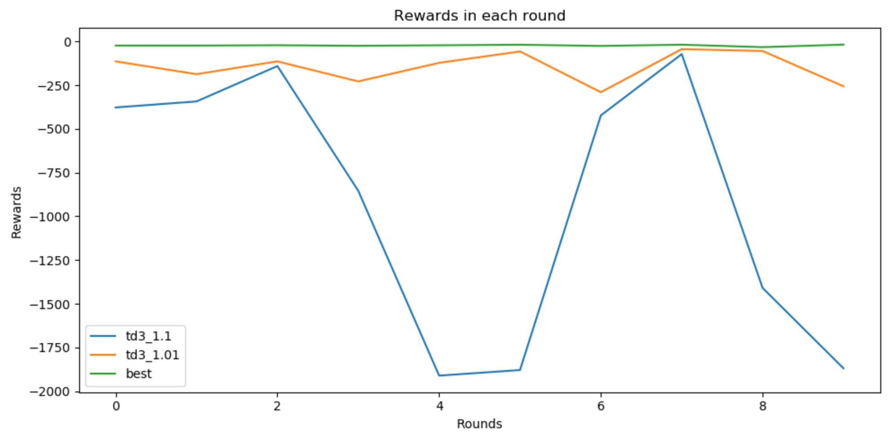
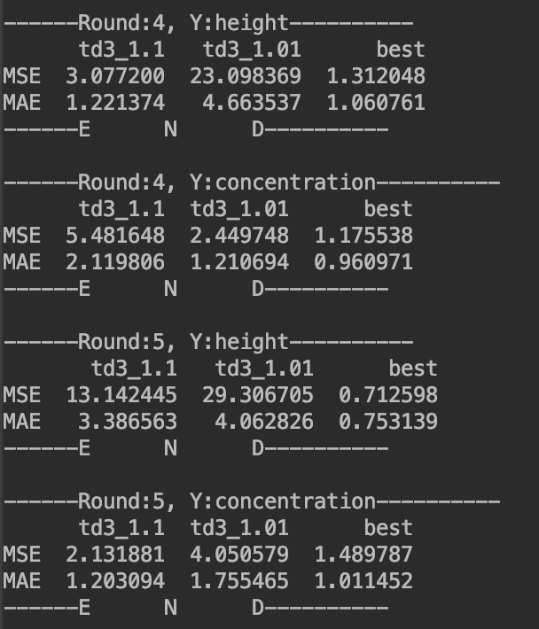

# 评估与可视化

## 可视化基类

该模块主要用于对控制结果进行评估以及可视化。目前具有的可视化功能：

1. 对每个中心调度器产生的实验结果中控制器奖赏变化进行折线图可视化
2. 对每个中心调度器的控制模型评估结果进行折线图可视化
3. 对每个中心调度器的控制模型评估结果计算MSE、MAE，并转换为Dataframe打印到控制台，

- 构建方法

```python
def __init__(self, res_list,training_rounds=None,
                 exp_name=None, y_name=None, y_num=None,
                 reward_plt_param=None,
                 eval_plt_param=None,
                 ):

```

​	对action添加高斯噪音，适用于将action归一到(-1,1)区间的的仿真模型

- 参数详解:

  - res_list: (奖赏变化, 评估结果)

  - exp_name: 实验名称列表

  - y_name: y的名称

  - training_rounds: 训练轮次，等于中心调度对象中的rounds

  - y_num: y的维度大小

  - reward_plt_param: 画reward图的plt参数

  - eval_plt_param: 画评估图的plt参数

- 举例

  ```python
  from Control_Exp1001.common.evaluation.base_evaluation import EvaluationBase
  
  evaluation = EvaluationBase(res_list=res_list,
                                 	training_rounds=exp1.rounds,
                                  exp_name=["td3_1.1", "td3_1.01", "best"],
                                  y_name=["height","concentration"],
                                  y_num=2,
                                  reward_plt_param={"figsize":(10,10)},
                                  eval_plt_param={"figsize":(10,8)}
                                  )
  # 绘制奖赏折线图
  evaluation.draw_rewards()
  # 绘制控制效果
  evaluation.draw_eval()
  # 计算控制误差
  evaluation.error_eval()
  
  ```

- 效果展示

  - 控制效果评估

    

  - 奖赏变化

    

  - 误差计算

    

### 