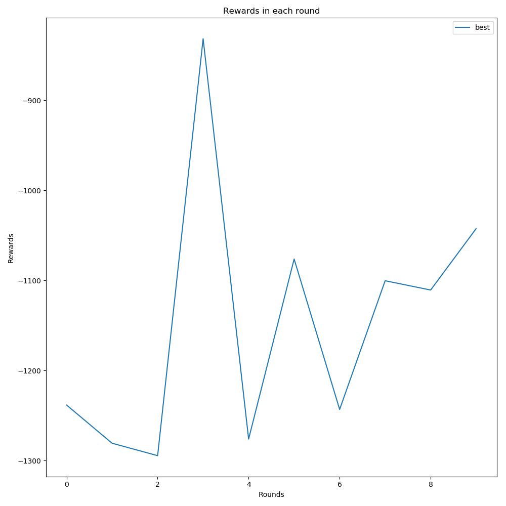
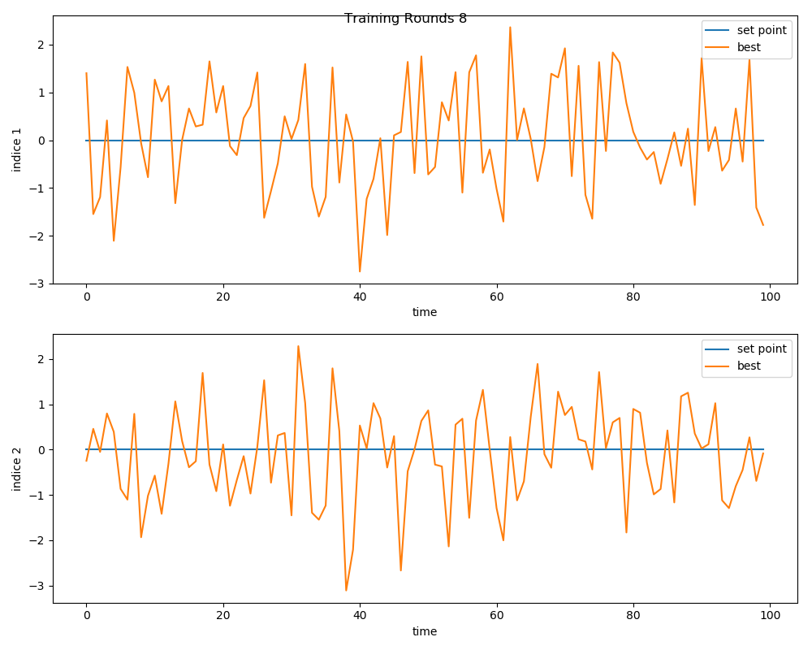

# Control_Exp1001

该实验平台由北京科技大学人工鱼与智能软件实验室Dr.袁兆麟开发维护，用于组内同学进行过程工业控制项目的开发以及实验。

## 项目地址

[pypi地址](https://test.pypi.org/project/Control-Exp1001/) : https://test.pypi.org/project/Control-Exp1001/

[Github地址](https://github.com/y18810919727/Control_Exp1001) ：https://github.com/y18810919727/Control_Exp1001

## 

##  下载

直接pip下载：

```
python3 -m pip install --index-url https://test.pypi.org/simple/Control_Exp1001
```

验证

```python
>>> import Control_Exp1001 as ce
>>> ce.name
'Control_EXP1001'
```


## 使用方法

在过程工业控制的实验中，**工业仿真模型**和**控制模型**是最核心的、也是工作量最大的部分，为了简化科研人员在进行项目开发、算法研究时的工作量，能够专注于算法的研究以及留出更多的时间陪伴自己的家人、女朋友，我团队针对控制算法研究的共性特点，设计并实现了该控制平台，对部分通用性组件进行了封装，该平台主要提供以下封装：

1. 仿真模型
   - 仿真模型基类
   - 样例模型
2. 控制模型
   - 控制基类
   - 样例控制模型
   - [Actor-critic 类网络基类](#ac)
   - 主流ac网络实现
     - td3算法
3. 组件库
   - 经验回放池
     - 普通经验回放池
   - 奖赏计算器
     - 二范数奖赏计算器
   - 探索器
     - $\epsilon$ 探索
     - 高斯噪音探索
4. 中心调度
   - 多线程运行
   - 训练过程中控制效果评估
5. 控制性能可视化
   - 训练过程奖赏值变化
   - 控制效果可视化


### 简单案例

首先一个简单案例介绍该平台使用方法

##### 代码：

```python
#!/usr/bin/python
# -*- coding:utf8 -*-

from Control_Exp1001.exp.base_exp import BaseExp
from Control_Exp1001.exp.exp_perform import exp_multi_thread_run
from Control_Exp1001.common.rewards.demo_reward import DemoReward
from Control_Exp1001.simulation.demo_simmulation import DemoSimulation as Env
from Control_Exp1001.control.demo_control import DemoControl
from Control_Exp1001.common.evaluation.base_evaluation import EvaluationBase

# 定义奖赏计算器 weight_matrix代表控制目标量权重
reward = DemoReward(weight_matrix=[1,10])

# 定义环境
env = Env(
    dt=1,
    size_yudc=[2, 2, 0, 2],
    y_low=[-15, -15],
    y_high=[15, 15],
    u_high=[2, 2],
    u_low=[-2, -2],
    reward_calculator=reward,
    normalize=False
)

# 定义控制器
controller = DemoControl(u_bounds=env.u_bounds)

# 定义实验对象
exp = BaseExp(
    env=env,
    controller=controller,
    max_frame = 100000,
    rounds= 10,
    max_step=100,
    eval_rounds=5,
    eval_length=None,
    exp_name="demo exp"
)

# 运行实验exp
res_list = exp_multi_thread_run([exp])

# 对实验结果进行评估
evaluation = EvaluationBase(res_list=res_list,
                            training_rounds=exp.rounds,
                            exp_name=["best"],
                            y_name=["indice 1","indice 2"],
                            y_num=2,
                            reward_plt_param={"figsize":(10,10)},
                            eval_plt_param={"figsize":(10,8)}
                            )
                            
# 对实验结果进行可视化
evaluation.draw_rewards() # 绘制模型每个round内的奖赏和变化
evaluation.draw_eval() # 绘制模型评估结果

```

##### 运行结果

```json
demo exp begin
Exp :demo exp, Current round: 0
Exp :demo exp, Current round: 1
Exp :demo exp, Current round: 2
Exp :demo exp, Current round: 3
Exp :demo exp, Current round: 4
Exp :demo exp, Current round: 5
Exp :demo exp, Current round: 6
Exp :demo exp, Current round: 7
Exp :demo exp, Current round: 8
Exp :demo exp, Current round: 9
demo exp end
All exp stops
best peformed -1107.371796 in eval round 0
best peformed -929.769473 in eval round 1
best peformed -1062.559504 in eval round 2
best peformed -1286.128572 in eval round 3
best peformed -1024.141004 in eval round 4
best peformed -797.201223 in eval round 5
```


- 奖赏变化



- 控制效果图: 这样的图有六个

  


