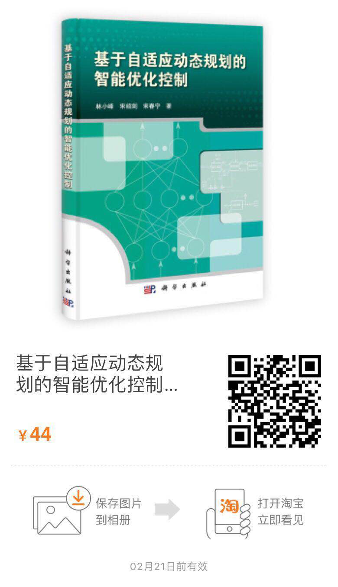

1. 强化学习基础

  - 西瓜书-机器学习
  - RL教材
    - 地址：[http://incompleteideas.net/book/the-book.html](http://incompleteideas.net/book/the-book.html)
    - 代码：[https://github.com/ShangtongZhang/reinforcement-learning-an-introduction](https://github.com/ShangtongZhang/reinforcement-learning-an-introduction)
  * 建议修炼时间：三天

2. 自适应动态规划

   - 直接看书着重看第二、三、四章。

   

   - 建议修炼时间：一周

3. 必看论文：

   - 改进的HDP网络做选矿控制ac网络加一个model 网络做选矿控制

     > Jiang, Y., Fan, J., Chai, T., Li, J., & Lewis, F. L. (2018). Data-Driven Flotation Industrial Process Operational Optimal Control Based on Reinforcement Learning. *IEEE Transactions on Industrial Informatics*. https://doi.org/10.1109/TII.2017.2761852

   - HDP和DHP的结合

     >  Wang, D., Liu, D., Wei, Q., Zhao, D., & Jin, N. (2012). Automatica Optimal control of unknown nonaffine nonlinear discrete-time systems based on adaptive dynamic programming. *Automatica*, *48*(8), 1825–1832. https://doi.org/10.1016/j.automatica.2012.05.049

4. 代码实现

这个圈子都是用matlab，用py实现的话可以直接参考actor-critic算法

[https://github.com/higgsfield/RL-Adventure-2](https://github.com/higgsfield/RL-Adventure-2)
优先看DDPG